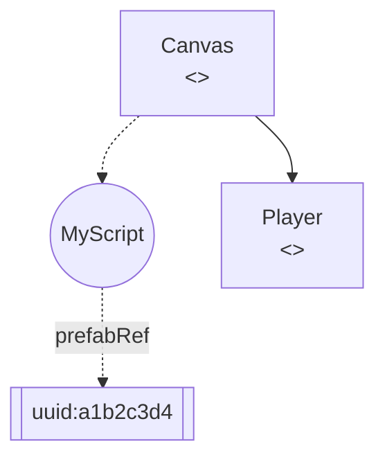

# Scene / Prefab JSON Walker — Cocos Creator 3.x

## File shape

A Cocos Creator 3.x `.scene` / `.prefab` file is a JSON document. Two common shapes:

**Flat array** (editor export):
```json
[
  { "__type__": "cc.SceneAsset", "scene": { "__id__": 1 } },
  { "__type__": "cc.Scene", "_name": "Main", "_children": [ /* refs */ ] },
  { "__type__": "cc.Node", "_name": "Canvas", "_components": [ /* refs */ ] }
]
```

**Single-root** (simplified for tooling):
```json
{
  "__type__": "cc.Scene",
  "_name": "Main",
  "_children": [
    { "__type__": "cc.Node", "_name": "Canvas",
      "_components": [
        { "__type__": "MyScript",
          "properties": { "prefabRef": { "__uuid__": "a1b2c3d4..." } } } ] } ]
}
```

The walker handles both — if the top-level is an array, it iterates every object; otherwise it treats the value as a single root.

## Fields of interest

| Field | Meaning |
|---|---|
| `__type__` | Cocos type tag (`cc.Scene`, `cc.Node`, `MyScript`, …) |
| `_name` | Human-readable node name |
| `_children` | Array of child node objects (or `__id__` refs in editor export) |
| `_components` | Array of component objects attached to the node |
| `properties` / `_properties` | Component field map; values may be `{ "__uuid__": "…" }` to reference other assets |
| `__uuid__` | Asset UUID (resolved via `.meta` file map in a future revision) |

## Algorithm (~50 LOC)

1. Parse the whole file via `JSON.parse(fs.readFileSync(f))` (upper bound: ~50 MB).
2. Normalize the root: array → first `cc.Scene`/`cc.Node`; object → single root.
3. DFS over `_children`, assigning each node an incremental `n<id>` Mermaid id.
4. For every node emit `n<id>["<name>\n<<type>>"]` and an edge `parentId --> n<id>`.
5. For each component in `_components[]`, emit a circular node `c<id>((ctor))` and a dashed edge `n<id> -.-> c<id>`.
6. Scan `component.properties` for `__uuid__` values; emit a rectangular node `u_<hash>[["uuid:<8-char>"]]` and a dashed edge `c<id> -. "fieldName" .-> u_<hash>`.
7. Cap at `maxNodes` (default 500) to prevent runaway output on huge scenes.

## Mermaid fragment



## Extensions (future)

- UUID resolver: scan every `.meta` file under `assets/`, build a UUID → relative path map, substitute `uuid:<short>` labels with the real asset path.
- Nested prefab variant expansion (currently opaque leaves).
- Cycle detection (scenes with reference loops are invalid in Cocos Editor, but a defensive check avoids infinite recursion on malformed input).
