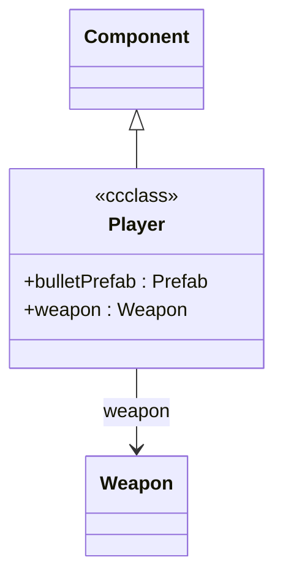

# `@ccclass` Extraction Spec (ts-morph)

**Status:** spec for v1.1.0 (not implemented in v1.0.0 MVP — capability stub emits `capabilities_skipped: ["classes"]`).

## Target shape

```ts
import { _decorator, Component, Prefab } from 'cc';
const { ccclass, property } = _decorator;

@ccclass('Player')
export class Player extends Component {
  @property(Prefab)
  bulletPrefab: Prefab | null = null;

  @property({ type: Weapon })
  weapon: Weapon | null = null;
}
```

## Extraction rules

1. Load `tsconfig.json` with `new Project({ tsConfigFilePath })`.
2. For every class declaration:
   - Check for a decorator with name `ccclass`. Capture the string argument if present, otherwise use the source class name.
   - Record the `extends` clause (if any).
   - For each property with a `property` decorator:
     - Record the field name.
     - Infer the referenced type from the decorator argument (type function like `Prefab`, or `{ type: Weapon }`).
3. Build cross-component edges only when the referenced type resolves to another `@ccclass` in the project.

## Mermaid emission



## Edge cases

- `@ccclass` without args → use the declared class name.
- `@property(cc.Prefab)` → typed field (`: Prefab`), no cross-edge unless `Prefab` is also `@ccclass` in-project.
- Inheritance from engine types (`Component`, `Node`) → emit the parent name but do not recurse into engine internals.
- Multiple decorators on the same field (e.g. `@property @serializable`) → order-insensitive.

## Library version

`ts-morph` `^21.0.0` — per-project install (`npm i --save-dev ts-morph`), version-locked to the project's TypeScript.
